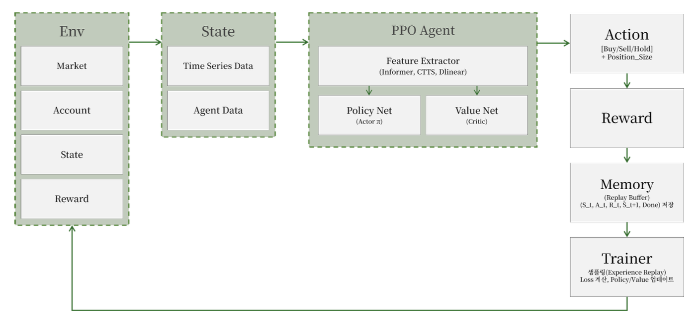
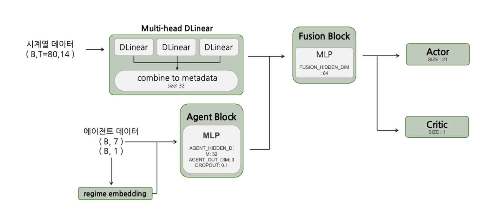
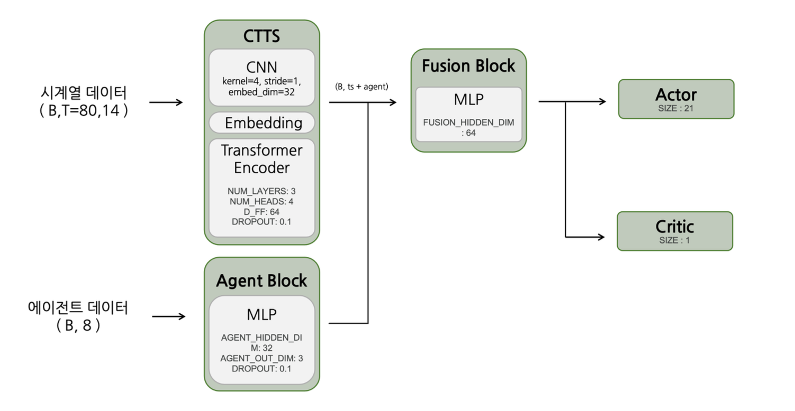
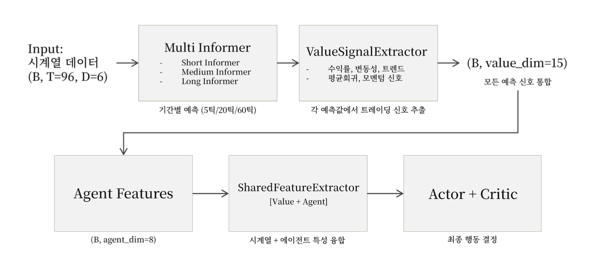
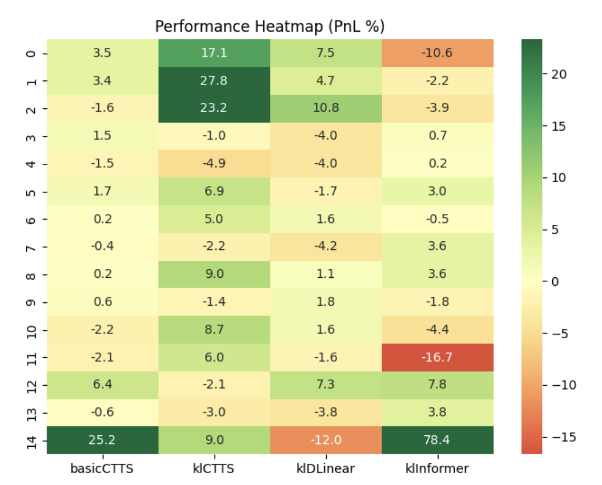
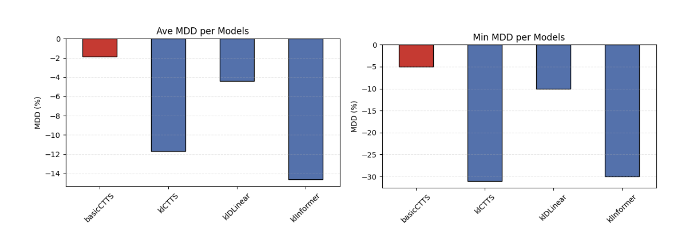
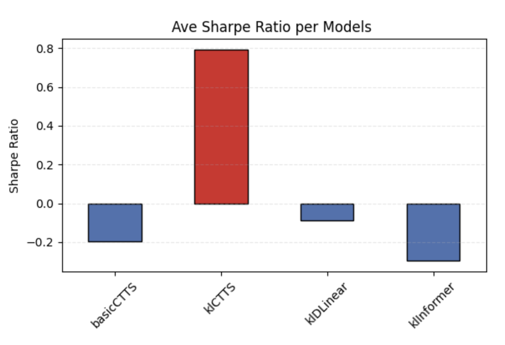
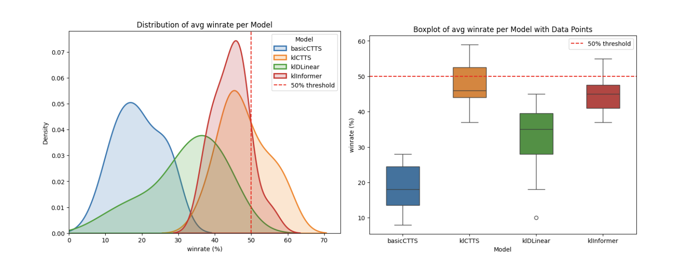

# YOLO-Futures
You Only Lose Once… 🤡

## Archive

### [PPT 🇰🇷](asset/archive/PPT_FuturesTraderAgent.pdf)
### [Report 🇰🇷](asset/archive/Report_FuturesTradingAgent.pdf)

## Abstract
최근 글로벌 금융시장은 코로나19 팬데믹, 지정학적 불안정성, 중앙은행 정책 변화 등으로 인해 높은 변동성을 보이고 있으며, 전통적 기법의 한계가 드러나고 있다. 본 연구는 **KOSPI200 미니 선물의 실제 분봉 데이터**를 활용하여 강화학습 기반 트레이딩 모델의 성능을 평가한다. 구체적으로 **PPO 알고리즘**을 적용하고, **DLinear·CNN+Transformer·Informer** 등 다양한 신경망 구조를 비교하며, Sharpe Ratio와 누적 수익률을 극대화하기 위한 보상 함수를 설계하였다.

본 연구는 단순 가격 예측을 넘어 매수·매도 강도와 자산 운용 전략 자체를 강화학습을 통해 학습하게 하였으며, 이는 기존 연구와 달리 의사결정과 자산 운용을 통합한 접근이라는 차별성을 지닌다. 본 연구는 강화학습 기반 금융 트레이딩 전략의 가능성과 한계를 검토함으로써 실제 시장 적용성과 금융 AI 연구의 확장 가능성을 제시한다.

Global financial markets have faced heightened volatility due to the COVID-19 pandemic, geopolitical instability, and shifts in central bank policies, revealing the limitations of traditional methods. This study evaluates reinforcement-learning-based trading models using real minute-level data from **KOSPI200 Mini Futures**. Specifically, we apply **the PPO algorith**m, compare neural network architectures such as **DLinear, CNN+Transformer, and Informer**, and design reward functions aimed at maximizing cumulative returns and the Sharpe Ratio.

Unlike conventional prediction-focused research, our approach enables reinforcement learning agents to directly learn not only price direction but also trading intensity and asset allocation strategies, thereby integrating decision-making and portfolio management. By examining both the potential and limitations of RL-based financial trading, this study enhances the applicability of such methods to real markets and suggests avenues for future financial AI research.

## 🏗️ Structure


## Network 
### DLinear Base


### CNN Transformer Hybrid Base


### Informer Base


## Result 
실험 결과, KL 기반 진입 규제를 적용한 CTTS 모델은 **평균 수익률 6.5%, Sharpe Ratio 0.8, 최대 낙폭 -12%, 승률 48%** 를 기록하며 수익성과 위험 관리 능력을 동시에 입증했다.  

Experimental results show that the CTTS model with KL-based entry regularization achieved **an average return of 6.5%, a Sharpe Ratio of 0.8, a maximum drawdown of -12%, and a win rate of 48%**, demonstrating both profitability and risk management capability.  

### PnL

### MDD

### Sharpe Ratio

### Win Rate 


## How To Use 
```
cd YOLO-Futures
pip install -r requirements.txt

// DLinear Base 
// MODIFY: config_DLinear.py
// RUN: python code/DLinearmain.py

// CNN Transformer Hybrid Base
// MODIFY: config.py
// RUN: python code/CTTSmain.py

// Informer Base
// MODIFY: Informer_config.py
// RUN: python code/Informermain.py

// RUN BackTester
// MODIFY: code/run_backtester.py
// RUN: python code/run_backtester.py

```

## About US

<table>
  <tr>
    <td align="center">
      <br>
      <b>YOLO-Futures</b><br>
      <a href="https://github.com/KanghwaSisters">KangHwaSisters</a> <br>
      <a href="https://www.ewha.ac.kr/ewha/index.do">Ewha Womans Uni.</a>
    </td>
    <td align="center">
      <br>
      <b>Jimin Lee</b><br>
      Team Leader <br>
      <a href="https://github.com/Tonnonssi">
        
      </a>
      <a href="mailto:tonnonssi@gmail.com">📧</a>
    </td>
    <td align="center">
      <br>
      <b>Soomi Lee</b><br>
      Team Member <br>
      <a href="https://github.com/SooMiiii">
        
      </a>
      <a href="mailto:smlee010303@gmail.com">📧</a>
    </td>
    <td align="center">
      <br>
      <b>Seungyeon Lee</b><br>
      Team Member <br>
      <a href="https://github.com/sabina381">
        
      </a>
      <a href="mailto:sabina2378@ewhain.net">📧</a>
    </td>
  </tr>
</table>

## References

[1] He, J., Zheng, C., & Yang, C. (2023). Integrating tick-level data and periodical signal for high-frequency market making. arXiv preprint arXiv:2306.17179.  
[2] Liu, X.-Y., Yang, H., Chen, Q., Zhang, R., Yang, L., Xiao, B., & Wang, C. D. (2020). FinRL: A deep reinforcement learning library for automated stock trading in quantitative finance. arXiv preprint arXiv:2011.09607.  
[3] Mou, S., Xue, Q., Chen, J., Takiguchi, T., & Ariki, Y. (2025). MM-iTransformer: A multimodal approach to economic time series forecasting with textual data. Applied Sciences, 15(3), 1241. https://doi.org/10.3390/app15031241  
[4] Sadighian, J. (2019). Deep reinforcement learning in cryptocurrency market making. arXiv preprint arXiv:1911.08647.  
[5] Sadighian, J. (2020). Extending deep reinforcement learning frameworks in cryptocurrency market making. arXiv preprint arXiv:2004.06985.  
[6] Sood, S., Papasotiriou, K., Vaiciulis, M., Balch, T. H., & Morgan, J. P. (2023). Deep reinforcement learning for optimal portfolio allocation: A comparative study with mean-variance optimization. (unpublished manuscript/preprint).  
[7] Tang, C. Y., Liu, C. H., Chen, W. K., & You, S. D. (2020). Implementing action mask in proximal policy optimization (PPO) algorithm. ICT Express, 6(3), 200–203. https://doi.org/10.1016/j.icte.2020.05.003  
[8] Wang, L., Chen, Y., Yu, G., Li, S., & Wu, X. (2024). A closer look at invalid action masking in policy gradient algorithms. Electronics, 14(16), 3327. https://doi.org/10.3390/electronics14163327  
[9] Zeng, A., Chen, M., Zhang, L., & Xu, Q. (2023). Are transformers effective for time series forecasting? In Proceedings of the AAAI Conference on Artificial Intelligence, 37(10), 11118–11126.  
[10] Zeng, Z., Kaur, R., Siddagangappa, S., & Rahimi, S. (2023). Financial time series forecasting using CNN and Transformer. arXiv preprint arXiv:2304.04912.  
[11] Zhou, H., Zhang, S., Peng, J., Zhang, S., Li, J., Xiong, H., & Zhang, W. (2021). Informer: Beyond efficient transformer for long sequence time-series forecasting. arXiv preprint arXiv:2012.07436.  
[12] Zhou, H. (2020). Informer2020 (GitHub repository). Retrieved from https://github.com/zhouhaoyi/Informer2020  
[13] KOSPI200 주가지수 선물/옵션 매매제도. (n.d.). Kiwoom Securities. Retrieved from https://www.kiwoom.com/h/help/trade/VHelpFuopTradeSystemView  
[14] 선물 (금융). (2025년 4월 7일). 위키백과. Retrieved from https://ko.wikipedia.org/wiki/%EC%84%A0%EB%AC%BC_(%EA%B8%88%EC%9C%B5  
[15] 미니 코스피200선물. (n.d.). Eugene Investment & Futures Co., Ltd. Retrieved from https://www.eugenefutures.com/main/IG/view/IG_0102_T5P2.htm?prdtId=IG_0102_T5P2  
[16] 시사경제용어사전. (n.d.). Ministry of Economy and Finance. Retrieved from https://www.moef.go.kr/sisa/main/main  
[17] 선물옵션 거래안내. (n.d.). Samsung Futures. Retrieved from https://www.samsungpop.com/?MENU_CODE=M1568700777221  